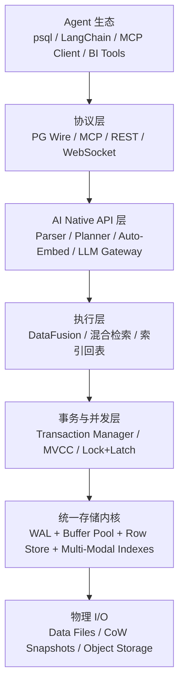
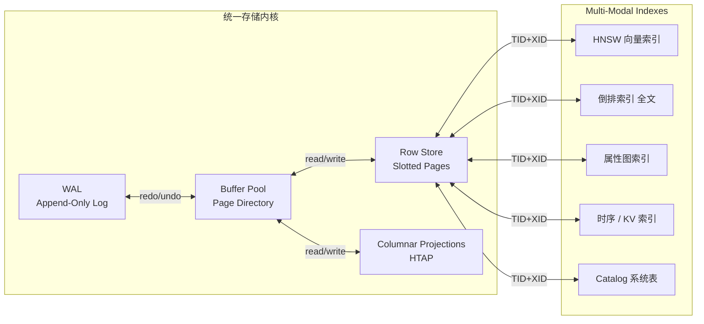
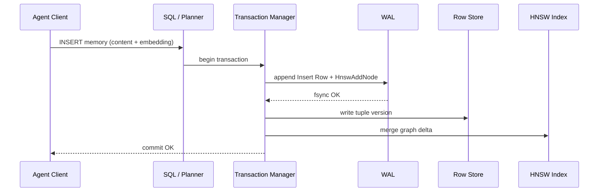

# Agent-Native 数据库架构设计思路

> 目标：设计一套全新架构，把 AI Agent 所需的所有数据操作（记忆、工具调用、状态、观测、协作）统一到一个数据库内完成，而不是把 Postgres、向量数据库、对象存储、缓存拼接在一起。

---

## 1. 核心设计思想

### 1.1 不是「一个数据库 + N 个引擎」，而是「一个事务内核 + N 种访问方法」

传统方案是：

```
Postgres（行存 + pgvector）+ Redis（缓存）+ Qdrant/Milvus（向量）+ ES（全文）+ S3（大对象）
```

这种架构的问题是：Agent 的一次写入要同步多个系统，事务原子性、崩溃一致性、可观测性都被割裂。

新架构的核心是：

```
统一事务内核（WAL + MVCC + LSN）
        │
        ├── B+Tree 访问方法  → 关系/TP
        ├── HNSW 访问方法    → 向量/语义记忆
        ├── 倒排索引         → 全文/BM25
        ├── 属性图索引       → Agent 推理链/工具依赖
        ├── 时序分区索引     → Agent 行为轨迹
        └── KV/队列索引      → 会话状态/任务队列
```

所有数据形态都是**同一套行版本上的不同视图/索引**。插入一行时，可以选择性地更新一个或多个索引；所有更新走同一个 WAL、同一个事务、同一个 LSN 时钟。

### 1.2 Agent Native 的第一性原则

| 原则 | 含义 |
|---|---|
| **Agent 身份一等公民** | 每行数据自带 `AGENT_ID` / `TRACE_ID` / `SESSION_ID`，不是应用层字段 |
| **操作即事务** | 工具调用、记忆写入、状态更新都是 ACID 事务，可回滚、可审计 |
| **查询即检索** | 一条 SQL 同时完成结构化过滤 + 向量相似度 + 全文 + 图遍历 |
| **事件即真相** | WAL / 行版本本身就是事件溯源的事实来源，物化视图是派生状态 |
| **分支即沙箱** | 每个 Agent 任务可 fork 隔离分支做 speculative execution |

### 1.3 关键洞察

> AI Agent 使用数据库的方式不是"CRUD 应用"，而是**持续进行「感知 → 记忆检索 → 推理 → 工具调用 → 状态更新 → 观测记录」的闭环**。数据库必须为这个闭环提供统一、低延迟、可审计、可回滚的持久化运行时。

---

## 2. 总体架构

### 图 1：整体分层架构（简化视图）



### 图 2：统一存储内核内部



### 图 3：Agent 写入记忆的数据流



> **读图提示**：
> - **横向**：Agent 请求从协议层进入，经 AI API、执行、事务，最终落到存储内核；
> - **纵向**：所有持久化组件（行存、列存、向量、全文、图、时序、KV、catalog）共享同一个 WAL + MVCC + LSN；
> - **关键**：Agent 的一次写入可能同时更新行存和多个索引，但只对应**一个事务、一次 WAL fsync、一个 LSN**。

---

## 3. 关键子系统设计

### 3.1 统一页格式与存储布局

#### 行存页（Slotted Page）

```
+------------------+
| Page Header      |  page_id, page_lsn, free_space, slot_count
+------------------+
| Tuple Data       |  从页头向页尾生长
| ...              |
+------------------+
| Slot Array       |  从页尾向页头生长，每个 slot 指向 tuple 偏移
+------------------+
```

#### Tuple Header（每行固定前缀）

```rust
struct TupleHeader {
    xmin: TxId,        // 创建事务
    xmax: TxId,        // 删除事务（0 表示未删除）
    cid: Cid,          // command id，同一事务内命令序号
    ctid: Tid,         // 指向新版本的 TID
    lsn: Lsn,          // 最后修改 LSN
    agent_id: AgentId, // Agent 身份
    trace_id: TraceId, // 追踪 ID
    session_id: SessionId,
    flags: u16,        // provenance, tombstone, etc.
}
```

> 从 day 1 就预留 `xmin/xmax/ctid/lsn`，即使 v0 不实现 MVCC，也让 Phase 1a 不需要改行格式。

#### 列存投影（Columnar Projection）

- 行存是主路径，服务 TP 和点查。
- 对需要 AP 分析的列，维护**列存投影**作为二级数据结构。
- 列存投影通过同一 WAL 更新：行更新时同步追加列存 delta。
- AP 查询可走列存投影；TP 查询走行存。
- 不引入独立列存引擎，HTAP 是同一引擎内的两种访问路径。

#### 大对象

- 图像/音频/视频 > 阈值（如 1MB）时写入对象存储（S3/MinIO/本地 FS）。
- 表中只存：`BYTEA` 引用列 + `VECTOR(n)` embedding 列 + 元数据 JSONB。
- embedding 让大对象可通过向量语义被检索。

### 3.2 One WAL, One LSN, One Transaction

所有变更——行插入、行更新、索引页修改、HNSW 图边添加、列存投影追加、catalog 修改——都写入**同一个 append-only WAL**，共享单调递增的 LSN。

```
LSN 1001: Insert into agent_memory
LSN 1002: HnswAddNode for the new embedding
LSN 1003: Update inverted index for 'contract dispute'
LSN 1004: Commit
```

提交时：
1. 将事务的所有 WAL 记录追加到日志缓冲区。
2. group commit：多个 ready 事务合并一次 `fsync`。
3. `fsync` 完成后，事务对所有后续读取可见。
4. 后台异步修改内存页和索引。

> 这是整个架构的**根契约**。任何新组件接入前必须先回答：写哪种 WAL 记录、如何参与 checkpoint、如何 redo/undo。

### 3.3 多模态访问方法（Access Methods）

访问方法是**二级索引插件**，统一挂在行版本之上。

| 访问方法 | 存储结构 | 索引键 | 值 | 用途 |
|---|---|---|---|---|
| **B+Tree** | 磁盘页 | 标量键 | TID list | 主键、二级索引、范围扫描 |
| **HNSW** | 节点文件 + 邻居文件 | 向量 | vector + TID + neighbor list | 语义记忆/RAG |
| **Inverted Index** | postings list + lexicon | token | TID list + BM25 分数 | 全文/关键词 |
| **Graph Index** | 邻接表 + 属性存储 | node_id | edges + properties | 推理链/工具依赖 |
| **Time-Series Index** | 时间分区 + 降采样 | timestamp | TID list + 聚合值 | Agent 轨迹/指标 |
| **KV/Queue Index** | B+Tree 特化 | key | value + TTL | 会话状态/任务队列 |

所有访问方法的条目都携带 **TID + XID**：
- `TID`（page_id, slot_id）指向行版本。
- `XID` 用于 MVCC 可见性判断。
- 行版本被 GC 时，所有索引条目一起回收。

### 3.4 MVCC 与版本链

```
Row v1: xmin=10, xmax=25, ctid→(page2,slot3), data="hello"
Row v2: xmin=25, xmax=0,  ctid→null,         data="hello world"
```

- `UPDATE` 不原地修改，而是插入新版本，旧版本保留。
- `DELETE` 设置旧行的 `xmax`。
- 读取时根据快照判断哪个版本可见。
- 垃圾回收：定期扫描，清理所有索引引用的、对任何活跃快照不可见的旧版本。

**HNSW 的特殊处理**：
- 图操作先写入 per-transaction delta。
- 提交时合并到全局图，并写 WAL。
- 回滚时丢弃 delta，无需反向拆除图边。

### 3.5 Agent Native 语义层

#### 内置类型

```sql
CREATE TYPE AGENT_ID AS TEXT;
CREATE TYPE TRACE_ID  AS TEXT;
CREATE TYPE SESSION_ID AS TEXT;
```

这些不是普通字符串，而是**一等公民**：
- 自动参与 provenance 记录。
- 自动加入 `query_trace`。
- 可被 RLS 策略引用。

#### Provenance 查询

```sql
-- 查看行的来源
SELECT * FROM agent_memory WITH provenance;

-- 返回：原始列 + _agent_id, _trace_id, _session_id, _txid, _lsn, _written_at
```

#### Query Trace

```sql
-- 按 TRACE_ID 回放一条 SQL 的完整生命周期
SELECT * FROM pg_trace WHERE trace_id = 'trace-42' ORDER BY lsn;
```

### 3.6 AI Native 服务层

| 能力 | 实现方式 | 是否进入事务核心路径 |
|---|---|---|
| **自动向量化** | `GENERATED ALWAYS AS embed(content) STORED` | 否：写入时异步调用外部 embedding API |
| **LLM 推理 UDF** | `llm_generate('gpt-4o', prompt)` | 否：advisory only |
| **查询优化助手** | 分析慢查询，推荐索引/重写 | 否 |
| **NL2SQL** | planner 前端，把自然语言转成执行计划 | 否 |

> **原则**：LLM 永远作为外部服务，不进入事务提交路径，避免 LLM 延迟/失败影响 ACID。

### 3.7 工具调用与记忆统一

#### 工具注册

```sql
REGISTER TOOL send_email AS
  INPUT (to TEXT, subject TEXT, body TEXT)
  HANDLER 'https://api.internal/v1/email'
  TIMEOUT 5s
  RETRIES 3;
```

#### 工具调用

```sql
-- 工具调用结果作为事务的一部分写入数据库
INSERT INTO email_log (recipient, status)
SELECT to, status FROM tool_call('send_email', 'user@example.com', 'Hello', 'Done');
```

工具调用被视为一种**特殊事务操作**：
- 如果工具调用失败，整个事务可回滚。
- 工具调用的输入/输出自动记录 provenance。
- 可通过 CDC 触发下游 Agent。

#### 记忆层次统一

| 层级 | 延迟 | 实现位置 | 数据库角色 |
|---|---|---|---|
| L0 上下文窗口 | <1ms | 应用层/推理框架 | 不参与 |
| L1 工作记忆 | <1ms | 内存表/临时表 | 可选，数据库内 volatile 表 |
| L2 语义记忆 | 10–50ms | HNSW 索引 | 数据库内向量检索 |
| L3 长期状态 | 50–100ms | 行存 + WAL | 数据库内持久化 |

> L2/L3 统一在一个数据库里，避免了"写 Postgres + 同步 Qdrant"的双写问题。

### 3.8 分支与沙箱（CoW Snapshots）

基于 CoW 快照实现：

- **Branch-per-Request**：每个 Agent 任务 fork 一个分支，在隔离分支中执行 SQL 实验。
- **Speculative Branching**：Agent 同时 fork 多个分支尝试不同解决路径，只提交成功分支。
- **时间旅行查询**：`SELECT * FROM t AS OF LSN 123456`。

实现：
- 数据文件不可变层设计。
- checkpoint 时以 CoW 方式写入新层。
- 分支只引用已有层，零拷贝。

### 3.9 可观测性

```
JSON EXPLAIN
     │
     ├── 算子耗时
     ├── 扫描行数
     ├── 索引使用
     └── 向量/全文/结构化各路径的代价

Provenance
     │
     ├── 每行的写入者身份
     ├── 写入事务
     └── LSN

Query Trace
     │
     ├── 解析 → 规划 → 执行 → 提交
     └── 按 TRACE_ID 聚合

Data Lineage
     │
     └── 向量/文档/行的上下游来源
```

---

## 4. 典型数据流

### 4.1 Agent 写入记忆

```sql
INSERT INTO agent_memory (id, content, metadata, created_by, session_id)
VALUES ('m-1', '客户要求退款', '{"topic":"售后"}', 'agent-42', 'sess-100');
```

内部流程：
1. SQL 解析 → Planner 识别到 `agent_memory` 有 vector_index 和 provenance。
2. 自动向量化（如果配置了）：异步调用 embedding API，得到 1536 维向量。
3. 事务协调器启动单语句事务。
4. 写 WAL：`Insert Row` + `HnswAddNode`。
5. fsync WAL。
6. 修改内存页：插入行版本，更新 HNSW 图。
7. 提交返回客户端。
8. Query Trace 记录完整生命周期，provenance 自动写入。

### 4.2 RAG 检索

```sql
SELECT content, metadata->>'source'
FROM agent_memory
WHERE team_id = 'sales'
  AND created_at > now() - interval '7 days'
  AND content @@ plainto_tsquery('退款')
ORDER BY embedding <=> $1
LIMIT 10;
```

内部流程：
1. Planner 拆分查询：
   - 结构化过滤 `team_id = 'sales'` → B+Tree 索引
   - 时序过滤 `created_at > ...` → 时序分区索引或 B+Tree
   - 全文 `content @@ ...` → 倒排索引
   - 向量 `embedding <=> $1` → HNSW 索引
2. 各索引返回候选 TID list。
3. 按 RRF 融合多个候选集。
4. 对最终 TID 进行 MVCC 可见性检查（根据当前快照过滤不可见版本）。
5. 回表读取行数据，返回 JSON/Arrow。

### 4.3 多 Agent 协作

```
Agent A                         Database                         Agent B
  │                              │                                │
  │ UPDATE order SET status='处理中' WHERE id=1                 │
  │ ─────────────────────────────>│                                │
  │                              │ 写入 WAL + 行更新               │
  │                              │ 触发 CDC / WebSocket 事件       │
  │                              │───────────────────────────────>│
  │                              │                                │ Agent B 收到事件
  │                              │<───────────────────────────────│ Agent B 读取最新状态
```

SSI 事务保证：如果 Agent A 和 Agent B 并发修改同一行，数据库根据写入集冲突决定串行化顺序或返回冲突错误。

---

## 5. 关键架构决策与取舍

| 决策 | 选择 | 原因 |
|---|---|---|
| **存储主格式** | 行存为主，列存投影为辅 | TP 是核心场景，AP 通过投影覆盖，避免纯列存不适合随机更新 |
| **向量索引** | HNSW 作为二级索引，条目 TID+XID | 与行存共享 MVCC/GC/WAL，避免独立向量数据库的双写 |
| **图模型** | 属性图作为原生访问方法 | Agent 推理链天然是图，关系表模拟图效率低 |
| **HTAP** | 统一引擎内实现，不引入独立 OLAP | 减少数据同步，保证 AP 查询的事务一致性 |
| **LLM/Embedding** | 外置服务 | 避免 LLM 延迟/失败影响 ACID，降低运维复杂度 |
| **扩展机制** | Rust trait + WASM | 替代 PG C 扩展，保证内存安全 |
| **协议** | PG wire protocol + MCP | 兼容现有生态，同时成为 Agent 标准工具 |
| **语言** | Rust | 内存安全 + 并发安全 + 现代数据库生态 |

---

## 6. 与现有 Phase 规划的映射

| 架构组件 | Phase 0 | Phase 1a | Phase 1b | Phase 2 |
|---|---|---|---|---|
| 行存页格式 | v0 固定页 + 预留字段 | 多版本行格式 | 稳定 | 列存投影 |
| WAL/Recovery | append-only + 全量 checkpoint | group commit + fuzzy checkpoint | 稳定 | 分布式日志评估 |
| MVCC | 单版本 + LSN | 版本链 + 可见性 + GC | SSI | 分布式事务评估 |
| B+Tree | heap scan / 最小 B-tree | 并发 B+Tree | 覆盖索引 | 列存索引 |
| HNSW | in-memory PoC | 持久化 + RC delta | SI/SSI + GC | 压缩 + 十亿级 |
| 倒排/全文 | 无 | 无 | BM25 + 中文分词 | 稳定 |
| 图模型 | 无 | 无 | 无 | 属性图/Cypher |
| 时序/KV | 无 | 无 | 无 | 时序分区 + KV 队列 |
| MCP | 无 | 无 | MCP Server | 完善 |
| CoW 分支 | 无 | 无 | 基础 | Branch-per-Request |
| 可观测性 | 基础日志 | JSON EXPLAIN | provenance + trace | 数据血缘 |

---

## 7. 下一步建议

把这个架构设计落地，需要优先产出以下设计文档：

1. **统一页格式与 Tuple Layout RFC**
2. **WAL 格式与 Recovery 算法 RFC**
3. **Access Method 接口与插件机制 RFC**
4. **HNSW 作为二级索引的 MVCC 协调 RFC**
5. **HTAP 列存投影设计 RFC**
6. **MCP Server 与 Agent Native API RFC**

其中 **1、2、3** 是 v0 存储引擎能否跑通的基础，建议最先启动。
